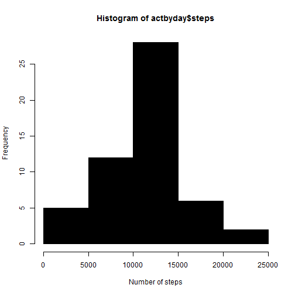
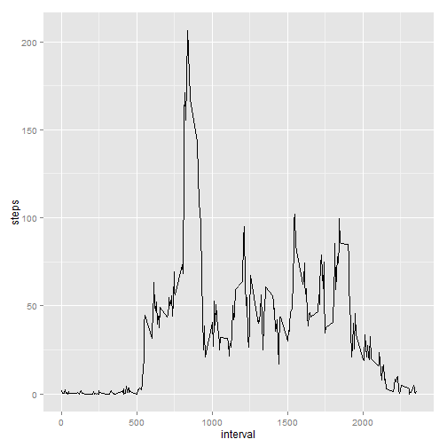

Title
========================================================

This is an R Markdown document. Markdown is a simple formatting syntax for authoring web pages (click the **Help** toolbar button for more details on using R Markdown).

LOADING AND PREPROCESSING THE DATA

1.Load the data (i.e. read.csv())


```r
act<-read.csv("activity.csv")
```

2.Process/transform the data (if necessary) into a format suitable for your analysis

```r
library(lubridate)
act$date<-ymd(act$date)
```
WHAT IS THE MEAN TOTAL OF STEPS TAKEN PER DAY?
 Run the mean of steps while removing NA's
 1. 1.Make a histogram of the total number of steps taken each day

```r
act1<-act[complete.cases(act),]

actbyday<-aggregate(steps~date,act1,sum)

act2<-hist(actbyday$steps, col="black", xlab="Number of steps" )
```

 
2. 2.Calculate and report the mean and median total number of steps taken per day


```r
summary(actbyday)
```

```
##       date                         steps      
##  Min.   :2012-10-02 00:00:00   Min.   :   41  
##  1st Qu.:2012-10-16 00:00:00   1st Qu.: 8841  
##  Median :2012-10-29 00:00:00   Median :10765  
##  Mean   :2012-10-30 17:12:27   Mean   :10766  
##  3rd Qu.:2012-11-16 00:00:00   3rd Qu.:13294  
##  Max.   :2012-11-29 00:00:00   Max.   :21194
```
What is the average daily activity pattern? 
1.Make a time series plot (i.e. type = "l") of the 5-minute interval (x-axis) and the average number of steps taken, averaged across all days (y-axis)

```r
library(ggplot2)
actpattern1<-aggregate(steps~interval,act1,mean)
actpattern<-ggplot(actpattern1, aes(interval,steps))
actpattern+geom_line()
```

 
2. Which 5-minute interval, on average across all the days in the dataset, contains the maximum number of steps?


```r
actpattern3<-ggplot(actpattern1, aes(interval,steps), xmin (800), xmax(900))
```
